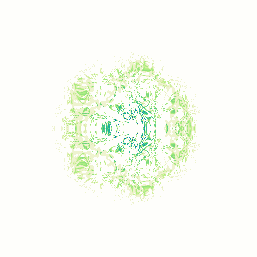

# Your Universal Cellular Automata

<p align="center">

</p>

[https://mybinder.org/v2/gh/riveSunder/yuca/gecco_pages?urlpath=/proxy/5006/bokeh-app](https://mybinder.org/v2/gh/riveSunder/yuca/gecco_pages?urlpath=/proxy/5006/bokeh-app)

# Quick Start

## Installation

```
virtualenv /my/env_path --python=python3.8
source /my/env_path/bin/activate 
```
Install requirements:

```
git clone https://github.com/riveSunder/yuca.git
cd yuca
pip install -r requirements.txt
```

Install repo:

```
# uses the setup.py file in the repo root
pip install -e .
```

Run testing:

```
python -m testing.test_all

```


## Evolving CA rules

The tag argument (`-t` or `--tag`) currently has important implications for evolution runs. Including 'orbium' or 'geminium' in the tag string is used to set the neighborhood kernel used by the CA. Only the kernels from [Lenia](https://arxiv.org/abs/1812.05433) CA _Hydrogeminium natans_ and _Orbium_ are supported right now, and if neither is included in the tag the neighborhood kernel parameters will be sampled from a random uniform distribution. The neighborhood kernel is currently not evolved (only the update function parameters are), so it's not recommended to rely on randomly initialized kernels (yet). 

```
python -m yuca.evolve -b 64 -c 256 -d cuda:0 -g 20 -k 13 -l 3 -m 128 -p 16 -s 42 -t my_geminium_tag
```

## Evolving mobile patterns

To evolve patterns 'pattern' must be included in the tag (`-t`). It also wouldn't make sense to have a batch size (`-b`) or replicates (`-l`) greater than 1, because CPPNs and CA dynamics are both ostensibly deterministic (although floating point precision errors do sometimes play a role).

You can evolve patterns by loading a config file (`-cc` or `--ca_config` arg) or a progress log from a CA evolution run (`-i` or `--input_filepath`), the former is recommended. 

```
python -m yuca.evolve -b 1 -c 256 -cc ca_configs/orbium.npy -d cuda:0 -g 20 -m 129 -p 128 -s 42 -t orbium_pattern_search
```

## Command line args to the `yuca.evolve` entry point

_This information can be accessed by entering `yuca.evolve --help`_

```
"-b", "--batch_size"
    type=int 
    default=64
    help="number of grid instances (vectorization)"

"-c", "--ca_steps", 
    type=int
    default=1024 
    help="number of ca steps to search for"

"-ca", "--ca_fn"
    type=str
    default="CA"

"-cc", "--ca_config"
    type=str
    default=None
    help="filename (or filepath) designating a ca_config to load"

"-d", "--device"
    type=str
    default="cpu"
    help="device to use (cpu, cuda, or cuda:x)"

"-dt", "--dtype"
    type=str 
    default="float32"
    help="set default dtype in torch"

"-e", "--selection_mode"
    type=int
    default=0
    help="selection mode: 0: truncation, 1: rand. tourney, 2: proportional"

"-f", "--env_fn"
    type=str
    default="HaltingWrapper"

"-g", "--generations"
    type=int
    default=32
    help="number of generations to train"

"-i", "--input_filepath"
    type=str
    default=None
    help="npy log file training curves etc."

"-k", "--kernel_radius"
    type=int
    default=13
    help="kernel radius. kernel shape will be 2r+1 by 2r+1)"

"-l", "--replicates" 
    type=int
    default=1
    help="number of replicates to use in get_fitness"

"-m", "--dim"
    type=int
    default=128
    help="grid x,y dimension (square edge length)"

"-p", "--population_size"
    type=int
    default=32
    help="number of individuals in population"

"-r", "--prediction_mode"
    type=int
    default=0
    help="prediction mode: 0-vanishing, 1-static end, 2-both"

"-s", "--seed"
    type=int
    nargs="+"
    default=13
    help="seeds to initialized PRNGs, can enter multiple integers separated by spaces"

"-t", "--tag"
    type=str
    default="pattern_search"
    help="string tag for identifying experiments"

"-v", "--conv_mode"
    type=str
    default="circular"
    help="padding mode to use, 'circular', 'reflect', or 'zeros'"
```
